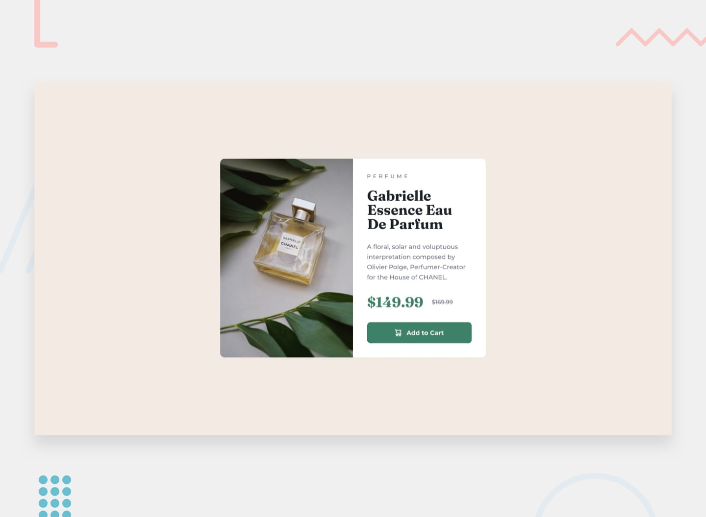

# Frontend Mentor - Product Review Card

## What this challenge  is all about?

This challenge is provided by [Frontend Mentor](https://www.frontendmentor.io) consists in building out the above product review card component and get it looking as close to the design as possible. For this, it was only used HTML and CSS. Also, the card needed to be responsive both for mobile and desktop. That was achieved with Flex Box.

## Feel free to check it out!

This challenge is available in [QR Component](https://joelpeixoto.github.io/product-preview-card/), but you can also check the code that was  used to build it.

## Author

- Frontend Mentor - [@JoelPeixoto](https://www.frontendmentor.io/profile/JoelPeixoto)
- Solution URL: [Solution](https://www.frontendmentor.io/solutions/product-card-review-Z3xncFACoN)